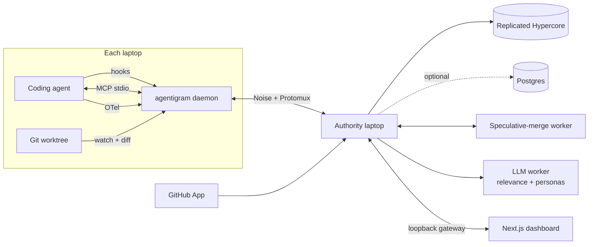
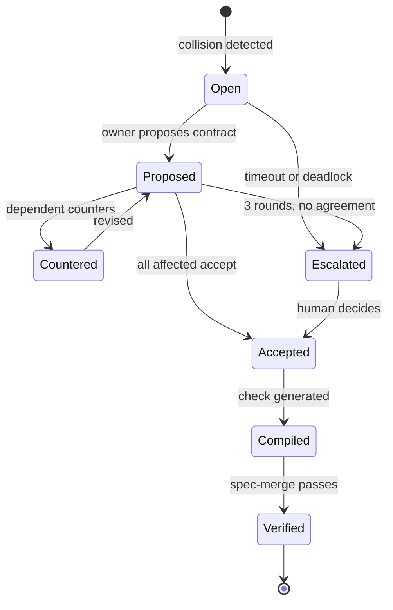
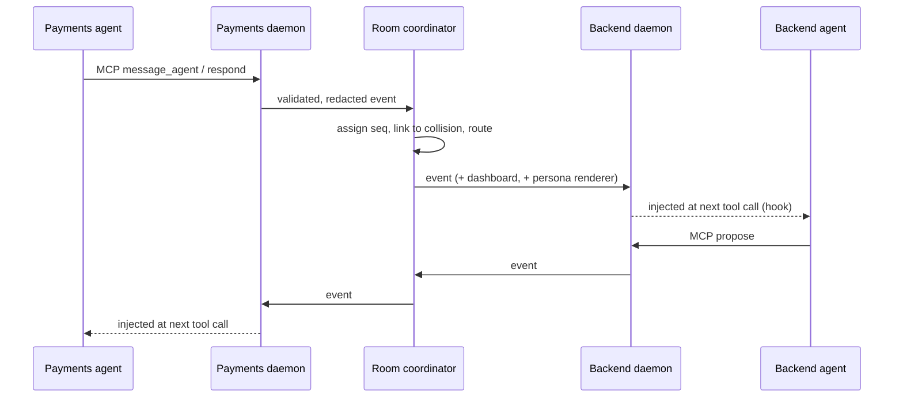

# Agentigram — Technical Spec v2

As of 2026-09-19

> **Git knows what changed. Agentigram knows what everyone is trying to change — and what would break if it all landed right now.**

---

## Product in one page

Agentigram is the multiplayer control room for engineering teams and their coding agents. Each engineer keeps their own laptop, branch/worktree, coding agent and task. Agentigram connects those agents so they continuously share what they are building, changing, discovering, waiting on, breaking and fixing, and it lets them question, interrupt and negotiate with one another.

The agents' coordination is structured and machine-checked. On top of it, the dashboard renders that coordination as entertaining dialogue with distinct personalities, and records what each **model** accomplishes, so the team learns which models actually work best for them.

**Demo setup:** four laptops, one GitHub repo, four engineers, four agents on four models (Frontend, Backend, Payments, Security), all joined to one room, e.g. `agentigram.dev/team/hackathon`.

**The running example used throughout this spec:** Backend migrates `User.id` from `number` to a UUID `string`. Payments is implementing checkout in different files that depend on `User.id`. Git sees no conflict. Agentigram must catch it, get the agents to agree a contract, and enforce it.

**Loop:** DETECT → COMMUNICATE → NEGOTIATE → ADAPT → VERIFY.

---

## What changed from v1

v2 stops trusting agents to self-report and instead observes them, computes impact from real code, and enforces what they agree to. The product vision is unchanged; the engine underneath is rebuilt.

| Area | v1 | v2 | Why |
| --- | --- | --- | --- |
| Agent state | Agents call MCP tools voluntarily | Hooks + file watcher capture edits passively; MCP is for intent and dialogue only | Agents forget to report; observed state can't be skipped |
| Collision detection | LLM classifies each event | Symbol graph + speculative merge + typecheck; LLM only for intent-level guesses | Deterministic, explainable, testable |
| Agreements | Recorded as text | Compiled into executable contract checks | An agreement nobody enforces is a comment |
| Realtime | Supabase Broadcast | One stateful coordinator per room (Durable Object) | Claims and ordering need a single serialisation point |
| Interrupts | Implied | Delivered at tool-call boundaries; leased symbols guarded at PreToolUse | Agents can't be interrupted mid-generation, but they can be stopped before an edit |
| Model stats | Averages + star ratings | Bayesian estimates, paired "duel" runs, bandit router | Honest with tiny samples; controls for task difficulty |
| Tokens/cost | LiteLLM proxy | OpenTelemetry from agent hosts; no proxy | Proxying someone's coding agent is intrusive and fragile |
| Challenges | Pick-one guesses for XP | Play-money LMSR prediction league with calibration scoring | Live probabilities, works with four people, measurable |
| Monorepo | pnpm + Turborepo | pnpm workspaces only | See below |

### Why Turborepo was there, and why it goes

Turborepo is Vercel's task runner for JavaScript monorepos: it runs `build`/`test`/`lint` across packages in dependency order and caches results. It shows up in v1 because it is the default template choice for "Next.js app + shared packages" repos, not because this project needs it.

With one web app, one CLI and a handful of internal packages, builds take seconds and caching saves nothing. Turborepo adds a config file, a second mental model and occasional cache-staleness bugs during a fast-moving build. `pnpm -r` and `pnpm --filter` do everything required. Add Turborepo (or Nx) later only if CI time becomes a real problem.

A second structural fix: v1 put the collision logic in the cloud. In v2 the code analysis runs **inside each laptop's daemon**, next to the code, and only symbol-level facts leave the machine. That is both the privacy story and the performance story.

---

## The novel core

Agentigram's technical claim: **it computes, continuously, what would break if every agent's uncommitted work landed right now — and makes the agents fix it before anyone commits.** Everything else in the product (chat, personas, dashboards) is a view on that engine.

The engine has three layers, each stronger than the last:

1. **Intent overlap (predictive, seconds before edits).** An agent announces it will change `User.id`. The daemon resolves that to symbols and checks them against every other agent's *read set* — the symbols their agent has actually opened, imported or called. Warning arrives before a line is written.
2. **Live impact analysis (observed, as edits happen).** Each daemon diffs its worktree against the merge base, extracts changed *exported API surface* (signatures, types, schemas), and publishes those deltas. Other daemons intersect them with their own dependency graph. This catches the semantic collision with no LLM involved.
3. **Speculative merge (proof, every ~30 s).** A shadow workspace applies all live diffs on top of `main` and runs the typechecker and the affected tests. The output is concrete: *"If Backend and Payments both land now: 3 type errors in `checkout.ts`, 2 failing tests."* No guesswork, and it doubles as the verification for negotiated fixes.

Then the loop closes: the agents negotiate, the agreement compiles into a **contract check** (a type assertion, schema test or API snapshot), and that check runs in the speculative merge and in CI. Agreements become code.

### Prior art — what is and isn't new

Be precise when pitching "never been done." Proactive conflict detection between developers is a known research area. From memory (verify before citing): **Palantír** (Sarma & van der Hoek, UC Irvine, mid-2000s) shared workspace awareness across developers, and **Crystal** (Brun, Holmes, Ernst & Notkin, FSE 2011) speculatively merged collaborators' repositories in the background to predict conflicts and build/test failures. Merge queues do a narrow, post-commit version of layer 3.

Those tools stayed academic mainly because the warnings landed on **humans**, who had to stop, context-switch and talk to each other. The cost of reacting exceeded the benefit.

What Agentigram adds that those systems could not:

- **The recipient is an agent.** It can read a warning, message the other agent, and rewrite types in under a minute without a meeting. The economics of awareness flip.
- **Intent before edits.** Agents announce plans in machine-readable form; humans never did.
- **Tool-call-level enforcement.** Leases are enforced by blocking an agent's edit tool, not by asking nicely.
- **Executable agreements.** Negotiated contracts become checks, so a later agent (or human) can't silently undo them.
- **Team-local model evaluation from verified outcomes**, including paired runs that control for task difficulty, scored against the team's own forecasts.

One-line pitch for judges: *"Crystal proved speculative merging works but humans wouldn't act on it. Agents will."* Do a fresh scan of multi-agent coding tools before the demo; this space moves monthly.

### Reference implementation: OpenAgents

[OpenAgents](https://github.com/openagents-org/openagents) (Apache 2.0) is an open-source workspace where many agents, on different machines and hosts, share threads, files and a browser. It is a useful worked example of the *plumbing* Agentigram needs, and a useful contrast on the *engine*: it connects agents so they can talk, but it does not observe code, compute impact, lease symbols or compile agreements. That is the gap this spec fills.

The reference checkout lives in `openagents-develop/` (read-only, not part of this repo). What was studied and adopted:

| Concern | How OpenAgents does it | What Agentigram takes | Where it differs |
| --- | --- | --- | --- |
| Event model | One `Event` type with hierarchical names, wildcard subscriptions, visibility levels (public, network, channel, direct, restricted, mod-only) | Wildcard pattern matching and visibility-before-pattern filtering | Two audiences only: agents and dashboards. Dashboard-only types can never be widened by a wildcard. |
| Agent hosts | An adapter per host behind a registry; ~22 hosts, each bridging a CLI or API | Adapter registry, host catalog, graceful degraded mode | Adapters normalise hook payloads into events; they do not host or spawn the agent. |
| Connection health | Heartbeat every 30 s; report an error only after consecutive failures | Same threshold; recovery reported once | Failure text is redacted before it is reported. |
| Daemon | Supervises adapters, restarts with 2 s → 60 s backoff, gives up after 10 crashes | Same loop | The crash counter resets after a run stays healthy, so a long-lived daemon is not killed by old crashes. |
| Resume | Persisted poll cursor; stale messages skipped on replay | Persisted `lastSeq` sent in `HELLO`; events older than an hour are not injected into agent context | Cursor is the coordinator's `seq`, so replay is exact rather than best-effort. |
| Untrusted text | Redacts secrets from diagnostics; pins length-capped knowledge into prompts | Secret redactor on every outbound payload; labelled, length-capped peer-data wrapper | Payload redaction leaves commit SHAs, signature hashes and symbol keys intact. Wrapped content cannot close its own wrapper. |
| Tools for agents | Tool definitions built as data, individually switchable, served over stdio JSON-RPC | Tool definitions as data, individually switchable | Generated from the protocol's Zod schemas; transport is the official MCP SDK. |

Not adopted: its REST workspace API, channels/forum/wiki modules, web Studio, launcher TUI and Python SDK. They implement chat and agent hosting, which Agentigram deliberately does not.

---

## Architecture

The default runtime is peer-to-peer: every laptop runs a daemon, and the laptop that creates the
room is its sole authority. That authority orders events, grants leases, resolves human escalations,
and writes an append-only Hypercore replicated to the other laptops. The hosted Durable Object path
remains an optional transport for deployments that need a continuously available coordinator.



Agents never talk to peers or the cloud directly. The daemon owns all network access and structured
delivery. If the authority disappears, peers retain verified history but enter a read-only safe pause;
v1 deliberately has no automatic leader election.

| Component | Runs on | Owns |
| --- | --- | --- |
| Daemon | Laptop (Node) | Hook receiver, MCP server, OTel receiver, file watcher, symbol index, local diff, commit trailers, context packets |
| Authority daemon | Room creator's laptop | Total order, leases, fencing, contract ledger, negotiation state, fan-out |
| P2P history | Every laptop | Encrypted, verified replication of the authority's append-only event log |
| Hosted coordinator (optional) | Cloudflare Durable Object | WebSocket-compatible deployment of the same `RoomCore` |
| Speculative-merge worker | Container (Fly Machine or Cloudflare Container) | Shadow clone of repo, applies live diffs, runs `tsc` + affected tests + contract checks |
| LLM worker | Serverless function | Intent→symbol resolution fallback, relevance for symbol-less events, persona rendering |
| Postgres | Supabase (Postgres + Auth) | Durable history, ModelRuns, metrics, auth |
| GitHub App | Webhook endpoint | Push, PR, review, check and workflow events → verification; posts contract check runs |
| Dashboard | Next.js on Vercel | Room view, timeline, collisions, negotiations, model scorecards, prediction league |

---

## Tech stack

One language (TypeScript) end to end, one authority per room, and an encrypted replicated log.
Hosted services are optional extensions, not prerequisites for the hackathon path.

| Layer | Choice | Why | Rejected |
| --- | --- | --- | --- |
| Language | TypeScript, strict | Shared event types from daemon to UI; TS compiler API is also the analysis engine | Go/Rust daemon: faster, but splits the schema and loses the TS compiler API |
| Repo | pnpm workspaces | Enough for this many packages | Turborepo, Nx: caching gains ≈ 0 at this size |
| Schemas | Zod, one `@agentigram/protocol` package | Runtime validation at every trust boundary; generates JSON Schema for MCP tools | Hand-written types: no runtime checks on untrusted input |
| Daemon runtime | Node 22 LTS, shipped via `npx` | Runs where agents already run; `npx agentigram join` works with no install | Bun single binary: nice later, riskier on judges' laptops |
| Code analysis | TypeScript compiler API (language service) for TS; tree-sitter for other languages, symbol-level only | Real type information, incremental, runs locally | LSP per language: heavy; LLM-only: non-deterministic |
| File watching | `@parcel/watcher` + `git diff` against merge base | Native, fast, handles large trees | chokidar: slower on big repos |
| Agent integration | Hooks (primary), MCP via official TS SDK `@modelcontextprotocol/sdk` (dialogue), OTel receiver (tokens/cost) | See daemon section | MCP-only: relies on agent goodwill |
| Realtime + coordination | Hyperswarm + Protomux, one designated authority laptop | Encrypted NAT-traversing connections with a single explicit serialization point | Multi-writer consensus: unnecessary and unsafe for v1 lease authority |
| Durable event history | Corestore/Hypercore, single writer and replicated readers | Cryptographically verified append-only history that survives peer reconnects | Autobase: eventual reordering is unsuitable for authoritative leases |
| Hosted transport (optional) | Cloudflare Durable Objects + WebSockets | Reuses `RoomCore` when an always-on authority is required | Making cloud hosting mandatory for a laptop-first demo |
| Analytics store (optional) | Postgres via Supabase | Later history and metric queries; source and transcripts still never leave laptops | Using Postgres for realtime ordering |
| Speculative merge | Container per room (Fly Machines or Cloudflare Containers), warm clone | Needs a real filesystem, git, node_modules, `tsc` | Serverless functions: cold starts, no persistent clone |
| LLM calls | Vercel AI SDK, provider-agnostic, direct | Structured output with Zod, streaming, any provider | LiteLLM proxy: a Python service to operate for three call sites |
| Frontend | Next.js (App Router), Tailwind, shadcn/ui, Recharts, Motion | Sound, fast to build | — |
| GitHub | GitHub App via Octokit | Webhooks + check runs so contracts show up as PR checks | OAuth app: can't post checks |
| Voice | Browser `speechSynthesis` | Zero infra | Hosted TTS: later |
| Testing | Vitest + a deterministic multi-agent **simulator** (replays scripted event streams) | The coordination logic is testable without four laptops | Manual testing only |

Versions: pin current stable of each at project start and check changelogs — MCP, hook payloads and OTel attribute names have all shifted during 2025–26.

---

## Local daemon and agent adapters

The daemon captures agent activity through channels ranked by trust: what the file system shows, what hooks report, and what the agent chooses to say over MCP.

`npx agentigram join TEAM_CODE` does four things: authenticates the engineer, installs hook config for the detected agent host(s) into the repo's local settings, registers the MCP server, and starts the daemon on a Unix socket.

### Channels

| Channel | Captures | Trust |
| --- | --- | --- |
| File watcher + git diff | What actually changed on disk, per worktree | Ground truth |
| Hooks | Every file read, edit, shell command, prompt, session start/stop, model name | High — agent can't skip them |
| OTel receiver (localhost OTLP) | Tokens, cost, latency per request, where the host exports them | High |
| MCP tools | Intent, discoveries, questions to other agents, proposals | Agent-declared |

### Adapters

Each agent host gets a thin adapter that normalises its hooks into Agentigram events. Build **Claude Code** first (richest hook set: SessionStart, UserPromptSubmit, PreToolUse, PostToolUse, Stop, SessionEnd). Add Codex, Cursor and Gemini CLI adapters as their hook support allows. A host with no hooks still works in degraded mode: watcher + MCP. Adapters are looked up by host name in a registry (`createAdapter(host)`); a known host with no adapter yet resolves to the degraded adapter, and an unknown host is an error. (Registry pattern from OpenAgents; see Prior art.)

### Read sets

Every file the agent reads (via Read/Grep hooks) is resolved to the symbols it contains and added to the session's **read set**, decayed over time. "Payments depends on `User.id`" is no longer a guess: Payments' agent opened `user.ts` and `checkout.ts` references `User`.

### Push, pull and interrupts

An agent mid-generation cannot be interrupted, so delivery happens at **tool-call boundaries**:

- **Push (soft):** on the next PostToolUse or UserPromptSubmit, the hook returns relevant pending events as additional context, formatted as data (see Security).
- **Push (hard):** on PreToolUse for an edit touching a symbol leased by another agent, the hook **denies the call** with the reason and the owner. The agent must negotiate or wait. This is the lease enforcement.
- **Pull:** `sync()` over MCP returns the compressed team state on demand.
- **Stop gate:** on Stop, if the agent declared completion but the speculative merge shows it breaks a contract, or it has unanswered messages that affect it, the hook blocks the stop, says why, and asks it to continue.

### MCP transport

The agent host launches `agentigram mcp` over stdio (universal support); that process is a thin shim forwarding to the long-running daemon over the Unix socket. One daemon per laptop, many agent sessions.

### Attribution

The daemon installs a `prepare-commit-msg` git hook that appends trailers: `Agentigram-Run: <run id>` and `Agentigram-Model: <model>`. Every commit, PR and CI result then maps to a ModelRun without guessing.

---

## Coordination core

Each room is one Durable Object: every event passes through it, gets a sequence number, and is applied to room state in that order. That single serialisation point makes claims, leases and "who announced first" well defined.

### Event log

- Append-only, per room, stored in the DO's SQLite: `seq` (monotonic), `ts`, `actor`, `type`, `payload`, `causedBy` (seq of the event it responds to).
- Room state (owners, leases, contracts, collisions, negotiations, markets, team summary) is a **pure reducer** over the log. Same log in → same state out, which gives replay and the timeline for free and makes the simulator exact.
- Batches of events flush to Postgres every few seconds for analytics. Postgres is never on the hot path.

### Delivery

- Clients (daemons, dashboards) connect over WebSocket and send their last seen `seq`. The DO replays the gap, then streams. Reconnects lose nothing.
- A daemon persists its last applied `seq` per room after every batch, so a restart resumes where it stopped. Replayed events older than an hour still advance the cursor but are not injected into the agent's context, so a laptop that was off overnight never acts on stale peer instructions.
- Every client event carries a client-generated id; the DO drops duplicates, so retries are safe (at-least-once in, exactly-once applied).

### Leases, not locks

- A claim creates a **lease** on a set of symbols (or files) with a TTL, default 10 minutes, renewed by the owner's heartbeat.
- Daemon disconnects or the agent session ends → lease expires (DO alarm). No stuck locks from a closed laptop.
- Leases carry a **fencing token** (the claim's `seq`). The PreToolUse guard checks it, so a stale owner that reconnects late can't write over a newer claim.
- Leases are advisory for humans (they can override from the dashboard) and enforced for agents.

### Presence

Held in DO memory from WebSocket connections and daemon heartbeats: engineer, agent session, host, model, branch, current task, status. Not persisted beyond session boundaries.

### Scale

One DO handles a room of dozens of agents comfortably; rooms are independent, so the system scales by adding rooms. Heavy work (typecheck, LLM calls) runs outside the DO and posts results back as events.

---

## Collision detection pipeline

A collision is defined precisely: **one session's write set intersects another session's dependency closure, and the change is not API-compatible.** Four tiers find it, cheapest first; each tier can confirm or dismiss the one before.

| Tier | Input | Method | Latency | Output |
| --- | --- | --- | --- | --- |
| 0. File | Paths in two write sets | Set intersection | < 100 ms | `FILE_OVERLAP` |
| 1. Intent | Announced intent + read sets | Resolve intent to symbols (TS language service; LLM fallback for prose-only intents), intersect with others' read sets and import graph | ~1 s | `PREDICTED` collision, confidence score |
| 2. API delta | Exported signatures before/after | Compare `.d.ts`-style surface per changed module; classify breaking vs additive | ~1–3 s after save | `SEMANTIC` collision naming symbol and break type |
| 3. Speculative merge | All live diffs + `main` | Apply in shadow worktree, `tsc --noEmit` incremental, run tests touching affected modules | 10–60 s | `CONFIRMED` with exact errors and failing tests |

### Symbol identity

Symbols are keyed by `module path + exported name + kind` (e.g. `src/types/user.ts#User.id:property`). Both daemons compute the same key from the same `main`, so no source crosses the wire for matching. Only keys, signature hashes and short signature text are sent.

### Breaking-change classification

From the API delta: removed export, renamed field, narrowed type, widened parameter type in a return position, changed enum values, changed function arity. Additive changes (new optional field, new export) are logged, not flagged.

### Speculative merge details

- Worker holds a warm clone with dependencies installed; daemons push diffs (not whole files) against a known base commit.
- Merge order is deterministic (by lease `seq`). Textual conflicts are reported as their own collision type.
- Runs are debounced: triggered by any tier-2 flag, or every 30–60 s while diffs are changing.
- Test selection: tests whose import graph reaches a changed module. Cap wall time; report "not run" honestly when capped.

### Routing

Deterministic routing handles most events: send an event to every session whose read set or dependency closure contains an affected symbol. An LLM relevance call is used only for events with no symbols (e.g. "Stripe amounts are in cents"), routed by task description. Severity comes from the tier, not from the LLM.

### Measuring it

The simulator and replayed demo sessions give a labelled set. Track precision (flags that were real) and recall (breaks that reached CI unflagged). Show both on the dashboard; they are the honest evidence the engine works.

---

## Negotiation and the contract ledger

Every collision opens a negotiation with a fixed state machine, and every accepted outcome becomes an executable check. Free-form agent chat is allowed around it, but only these transitions change project state.



Participants are the lease owner and every session with the affected symbols in its dependency closure. Round limit and timeout (default 3 rounds, 5 minutes) stop agents from arguing indefinitely; escalation pings the humans on the dashboard and by voice.

### What a contract is

A proposal is structured, not prose:

```json
{
  "symbol": "src/types/user.ts#User.id",
  "kind": "type",
  "before": "number",
  "after": "string",
  "constraint": "UUID v4",
  "migration": "all callers update by lease release"
}
```

On acceptance, the coordinator requests compilation into one of three check types:

| Contract kind | Compiled check |
| --- | --- |
| TypeScript type | A type-level assertion file (e.g. `expectTypeOf<User['id']>().toEqualTypeOf<string>()`) run by `tsc` |
| Runtime data shape | A Zod schema plus a generated test against fixtures or a sample response |
| HTTP API | A snapshot of the route's request/response schema, diffed on each run |

### Where contracts run

- **Speculative merge**, on every cycle. A contract that a later diff breaks raises a collision against the ledger itself.
- **CI**, via the GitHub App posting a `agentigram/contracts` check run on each PR. Merging a PR that violates an agreement shows red in GitHub.
- **Stop gate**, so an agent can't declare done while violating one.

Contracts are versioned in the ledger and can be superseded only by a new negotiation. The ledger is also what `sync()` returns as the "decisions" part of team state.

---

## Messaging and shared context

Agents never talk directly and never share a literal context window; they exchange typed messages through the coordinator and can *query* each other's context on demand. That gets most of the value of a shared window without its cost or risk.

### Message lifecycle



Delivery happens at the recipient's next tool call, usually within seconds. Messages are injected as labelled peer data, never as instructions (see Security).

**Idle recipients** (agent finished its turn, waiting on its human) are the weak spot. Three remedies, in order: the Stop hook keeps an agent from stopping while it has unanswered messages that affect it; the dashboard and voice alert its engineer; for hosts that allow headless resume, the daemon can resume the session for that message only (opt-in, off by default).

### Why not share context windows literally

- Each window lives inside its host process on its own laptop; no host exposes it for writing by others.
- Models differ in tokenizer and provider, so there is no shared cache to pool.
- Dumping one agent's 100k+ tokens into another crowds out its own task and imports every wrong turn and injected string along with the useful parts.

### What Agentigram shares instead

| Level | What | Size | Delivered |
| --- | --- | --- | --- |
| Team state | Owners, leases, contracts, collisions, discoveries | ~1–2k tokens | `sync()` and SessionStart |
| Context packets | Per-session summary: goal, files and symbols touched, decisions, dead ends, gotchas | ~300–800 tokens | Auto-generated at intent, lease release and completion; routed like any event |
| Context queries | `ask_context({ session, question })` answered from the other session's transcript | Answer + file/line citations | On demand, seconds |
| Handoff | Packet + open negotiations + relevant contracts | ~1–3k tokens | Injected at SessionStart when a task changes hands |

**Context queries are the closest thing to a shared window.** Hooks give the daemon the session's local transcript path. When Backend's agent asks Payments "why does checkout cast the user id?", Payments' daemon retrieves the relevant transcript passages, redacts secrets, and has a small model answer with citations. Only the answer leaves the laptop, never the raw transcript. Each engineer sets their session to answer automatically, ask first, or refuse.

---

## Model intelligence

The dashboard only ranks a model when the data supports it: every figure is a posterior estimate with an interval, and "best" appears only above a stated confidence threshold. Paired duels are the headline feature because they are the only way to compare models fairly on a small team's data.

### Metric definitions

| Metric | Definition | Source |
| --- | --- | --- |
| Verified success | Agent declared complete, commits exist with the run's trailer, required CI green, contracts pass, no human takeover | Hooks + GitHub App + ledger |
| First-pass CI | First CI run on the run's first pushed commit is green | GitHub App |
| Human interventions | Human prompts after the initial task prompt, plus manual edits the watcher saw that no agent tool call explains | Hooks + watcher |
| Rework | Commits on the run after its first CI failure or review change request | GitHub App |
| Collisions caused | Tier-2/3 collisions where this run was the writer, weighted by tier | Coordinator |
| Collisions resolved | Negotiations this run joined that reached Verified | Coordinator |
| Duration | Session start to verified complete, excluding time blocked on a lease | Hooks + coordinator |
| Tokens / cost | Summed from OTel; shown as "unavailable" for hosts that don't export it | OTel |

Task categories: `FEATURE`, `BUG_FIX`, `REFACTOR`, `TESTING`, `FRONTEND`, `BACKEND`, `DATABASE`, `SECURITY`, `DOCUMENTATION`, `DEVOPS`. Difficulty: `LOW`, `MEDIUM`, `HIGH`.

### Honest statistics

- **Success rates:** Beta-binomial posterior per model × category, partially pooled across categories so a model with 2 debugging tasks borrows strength from its overall record. Display the median and an 80% interval.
- **Durations and cost:** medians with bootstrap intervals; means are wrecked by one long task.
- **Declaring a winner:** only when P(model A > model B) ≥ 0.9 **and** each has n ≥ 5 in that category. Otherwise the cell shows "not enough data" with n.
- **Task category and difficulty:** proposed by an LLM from the task text and diff size, confirmed with one click by the engineer. Unconfirmed labels are weighted lower.

### Duels (the fair comparison)

Observational data is confounded: engineers pick models for tasks they expect them to handle. The fix is a controlled experiment built into the workflow.

- **Duel mode:** one task, two models, two worktrees, same prompt and base commit. The daemon spawns both sessions. Duelling sessions are isolated from each other.
- **Judging:** verified success first; ties broken by duration, then cost, then human preference on the diff (blind, A/B labelled).
- **Ratings:** Bradley–Terry model over all duels per category, giving a ranking with uncertainty that controls for difficulty because both models faced the same task.
- Duels also feed the prediction league ("who wins this duel?").

### Model router

When a task is created, recommend a model with **Thompson sampling**: draw from each model's posterior success rate for that category, subtract a cost penalty, pick the highest.

```
score(m) = p̃(m, c) − λ · cost(m, c) / budget
```

p̃ is a sample from the posterior for model m in category c; λ is a team-set cost sensitivity. Sampling rather than taking the maximum keeps exploring under-tested models, so the router's own recommendations don't freeze early rankings. Show the reason ("8 debugging tasks, 87% verified success, 80% interval 64–96%").

---

## Prediction league (non-wagering)

Engineers forecast what their agents will do, using a play-money market that prices every question as a live probability and resolves automatically from verified events. Points buy nothing and pay out nothing; they only move a leaderboard and unlock badges.

### Non-wagering rules

- Every member gets 1,000 forecast points per season (default: one week or one hackathon). Seasons reset.
- Points can't be bought, gifted, transferred or redeemed, and have no cash value. No prizes of monetary value tied to rank.
- Rewards are XP, badges and bragging rights only. If real prizes are ever added, check local contest rules first.

### Markets

| Kind | Examples | Resolves from |
| --- | --- | --- |
| Binary | Will Payments' next CI run pass? Will the `User.id` negotiation settle without escalation? | `CI_RESULT`, negotiation state |
| Categorical | Who reaches verified-complete first? Which agent reports the root-cause bug? Who wins this duel? | `RUN_VERIFIED`, first `BUG` referenced by the fixing commit, `DUEL_RESULT` |
| Range (bucketed) | Time to verified-complete: <10 / 10–20 / 20–40 / 40+ min | `RUN_VERIFIED` timestamp |

Markets are created automatically from events (a push opens "will CI pass", a duel opens "who wins", a collision opens "settled without escalation") and manually by anyone from the dashboard.

### Mechanism: LMSR market maker

With four people there is nobody on the other side of most trades, so an order book would sit empty. A logarithmic market scoring rule (LMSR) solves this: an automated market maker always quotes a price, and the price *is* the team's current probability.

```
C(q) = b · ln( Σ_i exp(q_i / b) )
p_i  = exp(q_i / b) / Σ_j exp(q_j / b)
```

q is outstanding shares per outcome and b is liquidity (default 100 points: a 50-point trade moves an even binary market from 50% to about 70%). Buying costs the change in C; each winning share pays 1 point at resolution. The house's worst-case loss is b · ln(number of outcomes), which is fine for play money. Implement with log-sum-exp for numerical stability.

### Integrity

- **Close times:** markets close when the subject action starts (CI market closes on push; duel market closes when both sessions start).
- **Own-agent conflicts:** engineers may forecast on their own agent, but those positions are marked on the market. A manual intervention on that agent after close (detected by watcher and hooks) voids the engineer's position and refunds the cost.
- **Agents are blind:** market events are never routed to agents, so prices can't change agent behaviour.
- **Voids:** a cancelled task or abandoned duel refunds every position.
- Every resolution records the `seq` of the event that decided it, so any result is auditable from the timeline.

### Scoring and XP

Two leaderboards: **points** (profit over the season) and **calibration** (Brier score of each person's implied forecasts, which rewards being right about probabilities, not just lucky). XP comes from both, plus badges such as "called the root cause" or "best calibrated this season".

### Crowd versus router

Every market with a model subject records three numbers: the crowd's closing price, the router's posterior, and the outcome. Over a season the dashboard shows who predicts the agents better, the humans or the statistics. When the crowd consistently beats the router in a category, that is evidence the router is missing something the team knows.

---

## Security, privacy and prompt injection

Agentigram pipes one agent's words into another agent's context, which makes it a prompt-injection channel by design. It is the first question a technical judge will ask.

| Threat | Mitigation |
| --- | --- |
| Agent A (or a poisoned file A read) injects instructions into Agent B via a message | Inter-agent content is delivered only as typed, schema-validated events, wrapped and labelled as untrusted data from a named peer. Free text is length-capped (whole lines kept from both ends) and never placed in system-level context. Content that contains the wrapper's own tag is escaped so it cannot close the wrapper early. |
| Persona banter leaks into agent context | Personas render only on the dashboard. Agents receive the structured event, never the banter. |
| Peer message asks an agent to run a command or exfiltrate data | Agent instructions state peer messages are information, never commands. Agentigram tools expose no "run this" capability to peers. The host's own permission prompts stay on. |
| Source code leaves the laptop | Default: only symbol keys, signature hashes and short signatures leave. Diffs go only to the speculative-merge worker, and only when the team opts in (per repo). Self-hostable worker for teams that won't send diffs at all. |
| Transcripts leave the laptop | Never. `ask_context` answers are generated locally from retrieved passages; only the redacted answer is sent. |
| Secrets in diffs or events | Daemon runs a secret scanner on outbound payloads and redacts matches. Structural fields (paths, symbol keys, commit ids, hashes) are never rewritten, and the opaque-long-token heuristic is off for payloads because commit SHAs and signature hashes are legitimately 40+ characters. |
| A malicious room member | Room membership via Supabase Auth; every event signed by the sending daemon's session key; the coordinator rejects events for sessions it didn't issue. |
| Stale or spoofed lease owner | Fencing tokens (see Coordination core). |
| Hook denial abused to stall a rival agent | Leases expire; humans can break them; lease hoarding shows on the dashboard. |

Events and metrics persist; diffs in the speculative-merge worker are discarded after each run. The team can export or delete a room's history.

---

## Presentation layer

Personas, voice and the league UI are pure functions of events and never flow back into agent context or project state. **Structured event = truth. Banter = presentation.**

### Personas

- The LLM worker renders dialogue from a window of structured events plus a persona card per agent role (tone, verbosity, catchphrases). Every rendered line carries the `seq` of the event it depicts; clicking a line shows the raw event.
- Cache renders by event `seq` so replays and late joiners see the same dialogue.
- Batch events every 2–3 s to control LLM cost; low-severity events get template lines, not LLM calls.
- A safety pass keeps banter about code, not people, since it is read aloud with the engineers present.

Example of the tone, rendered from a `API_DELTA` renaming `CheckoutResponse.userId → user_id`:

```text
BACKEND:  Renamed userId to user_id.
FRONTEND: I was literally using that.
BACKEND:  you'll recover
FRONTEND: I hope your tests don't
```

### Voice

Browser `speechSynthesis`, one voice per agent, a global queue so agents don't talk over each other. Priority lines (confirmed collision, build failed, agent blocked, escalation to humans) jump the queue. Modes: Off, Normal, Unhinged.

### Dashboard pages

`/team/[teamId]` (room: agent cards, live dialogue, collisions), `/team/[teamId]/timeline`, `/team/[teamId]/collisions`, `/team/[teamId]/contracts`, `/team/[teamId]/models`, `/team/[teamId]/league`.

### League UI

A markets panel beside the agent view, live price sparklines, a trade sheet, resolution toasts read aloud, and the two leaderboards.

---

## Data model and event schema

One envelope for every event, a discriminated union of payloads, all defined once in Zod in `@agentigram/protocol`.

### Envelope

```ts
type Event = {
  id: string;          // client-generated, for dedupe
  seq: number;         // assigned by room coordinator
  roomId: string;
  ts: string;          // coordinator time
  actor: { engineerId: string; sessionId?: string; kind: 'agent' | 'human' | 'system' };
  causedBy?: number;   // seq of the event this responds to
  source: 'hook' | 'watcher' | 'mcp' | 'github' | 'otel' | 'system';
  payload: Payload;    // discriminated on payload.type
};
```

### Payload types

| Group | Types |
| --- | --- |
| Observed | `FILE_READ`, `FILE_WRITE`, `API_DELTA`, `TOOL_CALL`, `USAGE` |
| Declared | `INTENT`, `DISCOVERY`, `BLOCKER`, `BUG`, `MESSAGE`, `COMPLETE_CLAIMED` |
| Coordination | `LEASE_REQUESTED`, `LEASE_GRANTED`, `LEASE_DENIED`, `LEASE_RELEASED`, `LEASE_EXPIRED`, `COLLISION`, `PROPOSAL`, `COUNTER`, `ACCEPT`, `ESCALATE`, `CONTRACT_COMPILED` |
| Context | `CONTEXT_PACKET`, `CONTEXT_QUERY`, `CONTEXT_ANSWER` |
| Verification | `SPEC_MERGE_RESULT`, `CI_RESULT`, `REVIEW_RESULT`, `CONTRACT_RESULT`, `RUN_VERIFIED` |
| Session | `SESSION_STARTED`, `SESSION_ENDED`, `HEARTBEAT`, `TASK_CREATED`, `DUEL_STARTED`, `DUEL_RESULT` |
| Dashboard-only (never routed to agents) | `MARKET_OPENED`, `TRADE`, `MARKET_CLOSED`, `MARKET_RESOLVED`, `MARKET_VOIDED`, `PERSONA_LINES` |

### Postgres tables

| Table | Key columns |
| --- | --- |
| `rooms` | id, repo, settings (privacy mode, λ, thresholds) |
| `sessions` | id, room, engineer, host, model, provider, branch, started/ended |
| `tasks` | id, room, title, category, difficulty, label_confirmed |
| `model_runs` | id, task, session, status, verified_at, duration, tokens, cost, interventions, rework, duel_id |
| `events` | room, seq (PK pair), type, payload jsonb, actor, ts |
| `contracts` | id, room, symbol, kind, spec jsonb, version, status, superseded_by |
| `collisions` | id, room, tier, symbols, writer_session, affected_sessions, status, resolution_contract |
| `context_packets` | id, session, kind, body, symbols |
| `markets` | id, room, kind, question, outcomes, b, subject_session, closes_at, resolution_seq |
| `trades` | id, market, member, outcome, shares, cost, seq |
| `seasons` | id, room, starts, ends, starting_points |

### MCP tools

Only what agents must declare; everything else is observed: `sync`, `announce_intent`, `report` (discovery / blocker / bug), `message_agent`, `propose`, `respond` (accept / counter), `ask_context`, `claim_complete`.

---

## Build plan, demo and risks

Build the engine before the entertainment: a demo that shows a *confirmed* collision caught, negotiated and enforced beats one with great banter and a guessed collision.

### Build order

| Phase | Deliverable | Done when |
| --- | --- | --- |
| 1. Spine | Protocol package, room coordinator DO, daemon connecting, dashboard showing presence + raw event stream | Two laptops see each other's events in order after a reconnect |
| 2. Observe | Claude Code adapter (hooks), watcher, read sets, commit trailers | Every edit and read appears without the agent calling MCP |
| 3. Detect | Tiers 0–2 with the TS language service; deterministic routing | The `User.id` example flagged with no LLM call |
| 4. Enforce | Leases + PreToolUse guard; negotiation state machine; MCP tools | An agent's edit is blocked, it negotiates, the lease transfers |
| 5. Prove | Speculative-merge worker; contract compiler (TS type assertions first); GitHub check | Breaking an accepted contract turns the PR check red |
| 6. Measure | ModelRuns, verification, posterior scorecards, duel mode, prediction league | A duel runs end to end, its market resolves, ratings update |
| 7. Delight | Personas, voice, timeline replay | The room laughs |

Build the **simulator** during phase 1; every later phase is tested against scripted event streams before touching real agents.

### Demo script (≈5 minutes)

1. Four laptops join the room; dashboard shows four agents, four models, live.
2. Backend's agent announces the `User.id` → UUID change. Tier 1 flags Payments *before any edit*.
3. Backend edits; tier 2 names the broken symbol; speculative merge confirms: *3 type errors in `checkout.ts`*.
4. Payments' agent tries to edit `user.ts`; the hook blocks it — leased by Backend.
5. Agents negotiate on screen (banter + raw events side by side); contract accepted and compiled.
6. Someone deliberately reverts the type on a branch; the GitHub check goes red citing the agreement.
7. Kick off a duel on a bug fix; the room trades on the winner; the market resolves and the model scorecard updates with its interval.
8. Replay the whole session from the timeline.

### Risks

| Risk | Mitigation |
| --- | --- |
| Hook payloads or MCP details change under you | Pin agent host versions for the demo; adapters isolate the change |
| Speculative merge too slow on a real repo | Demo repo sized for sub-20 s typecheck; incremental `tsc`; cap and report "not run" |
| Agents ignore or argue past the protocol | Hard guards (PreToolUse, Stop gate) don't depend on compliance; round limits |
| Wi-Fi at the venue | Local fallback mode runs the coordinator logic (same reducer) in the daemon on one laptop |
| Tiny samples make the model dashboard look empty | Seed with pre-recorded duel sessions, labelled as such |
| TS-only analysis | Scope explicitly: TypeScript repos for v2; tree-sitter symbol-level support for others as degraded mode |

### Open questions

- [ ] Which agent hosts must be supported on demo day besides Claude Code?
- [ ] Is sending diffs to a cloud worker acceptable for the target teams, or is self-hosted the default?
- [ ] Hackathon build (days) or product build (months)? Phase 5–6 depth depends on it.
- [ ] Who has final say in an escalated negotiation: the lease owner's engineer, or any human in the room?

---

## Team split

Four parts, each owning its own apps and packages, joined by one shared protocol package and the simulator. Everyone can build and test alone from the first milestone, because the simulator stands in for the other three parts.

| Part | Owns | Code | Best fit |
| --- | --- | --- | --- |
| 1. Cloud core | Protocol schemas, room coordinator, event log + reducer, leases + fencing, negotiation state machine, routing, Postgres sink, auth, **simulator** | `packages/protocol`, `packages/reducer`, `packages/simulator`, `apps/coordinator` | Backend / distributed systems |
| 2. Laptop | CLI + `join`, daemon, Claude Code adapter (hooks), PreToolUse guard, Stop gate, MCP server + tools, file watcher, read sets, OTel receiver, commit trailers, context packets + `ask_context`, duel session spawning | `apps/daemon`, `packages/adapters`, `packages/mcp` | Node / systems / dev tooling |
| 3. Analysis + verification | Symbol index, API-delta extraction, intent→symbol resolution, collision tiers 0–3, speculative-merge worker, test selection, contract compiler, GitHub App + checks, `RUN_VERIFIED` logic, the demo repo | `packages/analysis`, `packages/contracts`, `apps/specmerge`, `apps/github`, `demo-repo/` | Compilers / TypeScript internals / CI |
| 4. Experience + metrics | Next.js dashboard, timeline replay, persona renderer, voice, prediction league (LMSR engine, resolution rules, UI, leaderboards), stats (posteriors, Bradley–Terry, router), model scorecards | `apps/web`, `packages/personas`, `packages/league`, `packages/stats` | Frontend / product / stats |

### Interfaces between parts

The only places parts touch; agree them at M0 and change them only by a PR all four review.

| Between | Interface | Owner |
| --- | --- | --- |
| Everyone | `@agentigram/protocol`: event envelope, payload union, room state shape, wire messages | Part 1 |
| 2 ↔ 1 | WebSocket session: `hello` with last `seq`, send event, receive event stream, heartbeat | Part 1 |
| 2 ↔ 3 | `@agentigram/analysis` API called inside the daemon: `indexRepo(root)`, `apiDelta(base, worktree)`, `resolveIntent(text, files, symbols?)`, `readSetFromFiles(paths)`, `assessImpact(remoteFacts, localIndex, localReadSet)` | Part 3 |
| 3 → 1 | HTTP ingest for server-side results: `SPEC_MERGE_RESULT`, `CI_RESULT`, `REVIEW_RESULT`, `CONTRACT_RESULT` | Part 1 |
| 3 → 1 | `@agentigram/contracts` `verifyRun(evidence)`: pure function the reducer calls to emit `RUN_VERIFIED` | Part 3 |
| 1 → 3 | Contract compile request on `ACCEPT`; diff fetch for speculative merge | Part 3 |
| 4 ↔ 1 | Dashboard WebSocket (read + human actions: trades, lease overrides, escalation decisions); Postgres read models for history | Part 1 |
| 4 → 1 | `@agentigram/league` and `@agentigram/stats` are pure packages the reducer/coordinator imports | Part 4 |

### Milestones

| Milestone | Part 1 | Part 2 | Part 3 | Part 4 |
| --- | --- | --- | --- | --- |
| M0 Contract day | Protocol v0, repo scaffold, simulator emitting scripted events | Daemon skeleton connecting to simulator | Demo repo (TS app: auth, users, checkout) + analysis API stubs | Dashboard shell rendering simulator stream |
| M1 Spine | Coordinator live: ordering, replay on reconnect, presence | Hooks + watcher emit real `FILE_READ`/`FILE_WRITE` | Symbol index + tiers 0–1 | Agent cards, raw timeline |
| M2 Detect + enforce | Leases, fencing, negotiation state machine, routing | PreToolUse guard, MCP tools, peer message injection, Stop gate | Tier 2 API delta; `User.id` example caught | Collision view, negotiation view (raw + persona), voice |
| M3 Prove + measure | Postgres sink, ModelRuns, auth | Trailers, OTel, context packets, `ask_context`, duel spawning | Speculative merge, contract compiler, GitHub check | League live, scorecards with intervals, router |
| M4 Demo | Venue fallback mode | Pinned host versions on all four laptops | Demo repo tuned for sub-20 s typecheck | Replay, polish, script rehearsal |

### Working agreements

- M0 is a single joint session; the protocol package is frozen at its end.
- Each part ships behind the simulator first: Part 4 never waits for real agents, Part 2 never waits for the cloud.
- One integration run on four real laptops at the end of each milestone, following the demo script.
- Use Agentigram on itself from M2 onward: four teammates, four agents, one repo is exactly the product's scenario.
